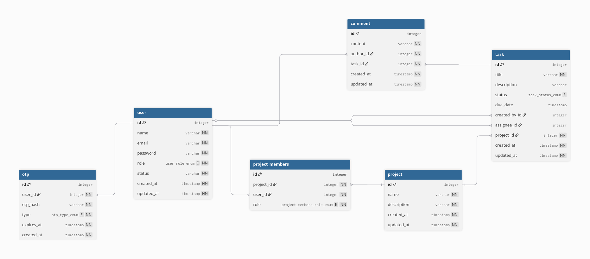

# Project Management API

A REST API built with **NestJS** for managing projects, tasks, comments, project members, and administrative moderation workflows.

This project is designed as a portfolio-ready backend service: it demonstrates authentication, database modelling, migrations, validation, protected routes, project-level permissions, admin-only endpoints, and clean modular NestJS architecture.

Local development uses Docker Compose with PostgreSQL.  
The deployed version runs on Render and uses Supabase PostgreSQL.

## Live Demo

The deployed API is available at:

`https://project-management-api-137k.onrender.com/api`

Swagger docs:

`https://project-management-api-137k.onrender.com/docs`

## Features

- JWT Authentication (Access + Refresh tokens)
- Email verification with expiring otp
- Verify email, and resend verification endpoints
- Role-based access control (Admin / User)
- Project-level authorization with owner, member, and viewer roles
- Dockerized environment (API + PostgreSQL)
- Database migrations with TypeORM
- Swagger API documentation

## Tech Stack

- **Runtime:** Node.js
- **Framework:** NestJS
- **Database:** PostgreSQL
- **ORM:** TypeORM
- **Auth:** Passport, JWT, bcrypt
- **Email:** Nodemailer
- **Documentation:** Swagger
- **Tooling:** Docker

## Installation (Docker)

#### 1. Clone the repository:

```bash
git clone https://github.com/VertessyMarton/Project-Management-API.git
cd Project-Management-API
```

#### 2. Rename environment file:

```bash
cp .env.example .env
```

#### 3. Build containers:

```bash
docker compose up --build
```

API runs on `http://localhost:3000`.

## Database

- Uses TypeORM migrations
- Migrations run automatically on startup

### Reset database

```bash
docker compose down -v
docker compose up --build
```

### Database Schema



## File Structure

This project follows the following file structure:

```text
api
├── src
│   └── <module>
│       └── dto/
│       └── entity/
│       └── enums/ (optional)
│       └── guards/ (optional)
│       └── decorators/ (optional)
│       └── types/ (optional)
│       └── <module>.controller.ts
│       └── <module>.module.ts
│       └── <module>.service.ts
│       └── <module>.service.spec.ts
│       └── <module>.repository.ts
│       └── <module>.repository.spec.ts
│   └── common
│   └── migrations
│   └── app.module.ts
│   └── data-source.ts
│   └── main.ts
├── test
```
